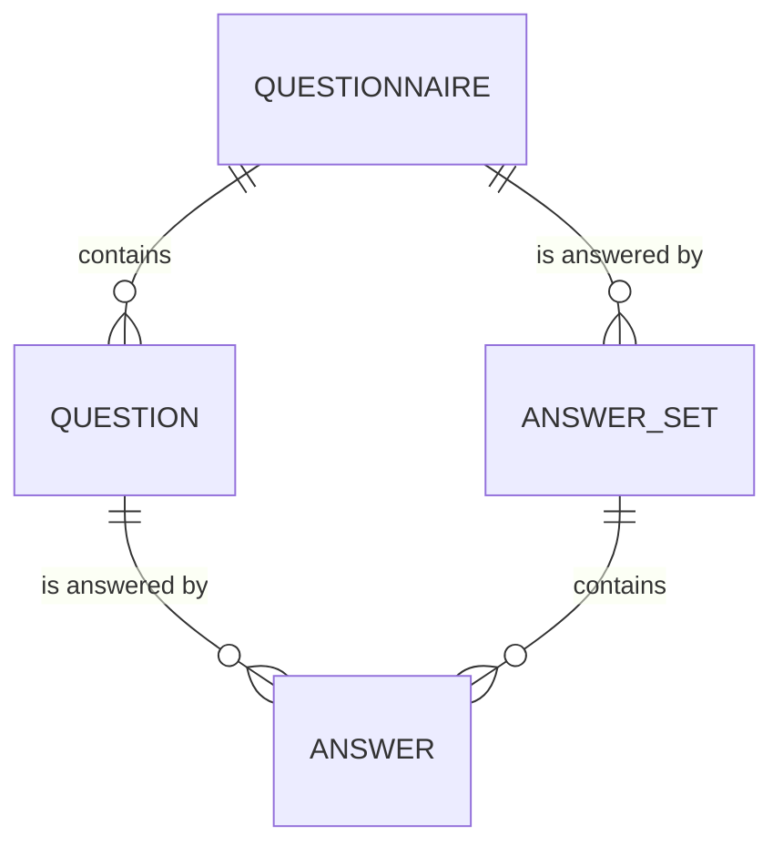
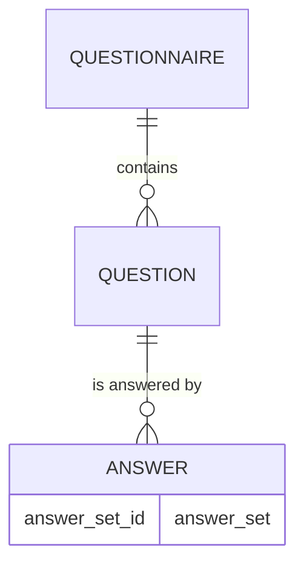

# Forms - Persistence

---

We need to think about our database schema

---



The diagram needs to commute

---

Alternative (probably easier, let's go with this for now)



---

Which interactions would we need?

- create a new questionnaire
- add a new question to a questionnaire
- get all questionnaires
- get all the questions for a questionnaire
- add all the answers of a questionnaire
- get all the answers for a questionnaire, grouped by
  - question
  - answer_set
- get all the answers for an answer_set
- get all the answers for a question

---

`groupBy`

```haskell
groupBy :: forall exprs aggregates. (EqTable exprs, Aggregates aggregates exprs) => exprs -> aggregates

Aggregates aggregates exprs => Transposes Aggregate Expr aggregates exprs

groupBy :: forall exprs aggregates. (EqTable exprs, Transposes Aggregate Expr aggregates exprs) => exprs -> aggregates

Transposes Aggregate Expr aggregates exprs => (Table Aggregate aggregates, Table Expr exprs, Congruent aggregates exprs, exprs ~ Transpose Expr aggregates, aggregates ~ Transpose Aggregate exprs)

groupBy :: forall exprs aggregates. (EqTable exprs, Table Aggregate aggregates, Table Expr exprs, Congruent aggregates exprs, exprs ~ Transpose Expr aggregates, aggregates ~ Transpose Aggregate exprs) => exprs -> aggregates

Congruent a b => Columns a ~ Columns b

groupBy :: forall exprs aggregates. (EqTable exprs, Table Aggregate aggregates, Table Expr exprs, Columns exprs ~ Columns aggregate, exprs ~ Transpose Expr aggregates, aggregates ~ Transpose Aggregate exprs) => exprs -> aggregates
```

does it work with `exprs ~ Expr a` and `aggregates ~ Aggregate a`

```
EqTable (Expr a) -- yes if `Sql DBEq a`

Table Aggregate (Aggregate a) -- yes if `Sql DBType a`

Table Expr (Expr a) -- yes if `Sql DBType a`

Columns (Expr a) ~ Columns (Aggregate a) -- yes

Expr a ~ Transpose Expr (Aggregate a) -- yes

Aggregate a ~ Transpose Aggregate (Expr a) -- yes
```

so we can consider

```haskell
groupBy :: (Sql DBEq a, SQL DBType a) => Expr a -> Aggregate a
́́```
