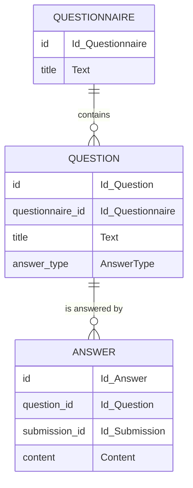

<style>
  .reveal pre {width: 100%; max-height: 600px;}
  .reveal pre code {max-height: 600px;}
  code {color: #c7254e;}
  .mermaid svg {display: flex; justify-content: center; margin: auto;}
</style>

# Haskell at Work - Persistence

---

The next step we want to tackle is persisting our data.

---

In the Haskell ecosystem there are several libraries one could choose to interact with the database.

They differ a lot in the level of abstraction they add on top of the database.

---

The simplest are [postgresql-simple](https://hackage.haskell.org/package/postgresql-simple) and [mysql-simple](https://hackage.haskell.org/package/mysql-simple)

---

We are going to use [rel8](https://hackage.haskell.org/package/rel8), a library which helps us to abstract away from the database and has a very Haskell-oriented approach

```yaml
-- package.yaml
dependencies:
  - rel8
```

---

First off, We need to think about our database schema

---



---

We can create this schema by running

```bash
docker-compose run
  -e PGPASSWORD=pwd
  -v $PWD/schema.sql:/schema.sql
  postgres psql
  -h postgres -U user -d db -w -f /schema.sql
```

---

In `Infrastructure/Persistence.hs` we already have the necessary code to describe our database schema using Haskell data types.

---

For every table we will have a data structure to represent table items

```haskell
data Questionnaire f = Questionnaire
  { questionnaireId    :: Column f (Id Domain.Questionnaire)
  , questionnaireTitle :: Column f Text
  }
  deriving (Generic, Rel8able)
```

---

And a data structure to connect the Haskell data structure to the underlying table


```haskell
questionnaireSchema :: TableSchema (Questionnaire Name)
questionnaireSchema = TableSchema
  { name = "questionnaire"
  , schema = Nothing
  , columns = Questionnaire
    { questionnaireId    = "id"
    , questionnaireTitle = "title"
    }
  }
```

---

The `name` and `columns` fields allow us to define what is the name of the table and of each field on the postgres side and to connect them to the Haskell side.

This allows detatching the naming on the database side form the ones in the code.

---

Now it is time to start writing some queries!

---

The first query we want to write is to extract all the available questionnaires:

```haskell
-- SELECT * FROM questionnaire
allQuestionnaires = each questionnaireSchema
```

We are defining a value which represents the query which extracts all rows from the table described by the `questionnaireSchema`.

---

The type of `allQuestionnaires` is

```haskell
allQuestionnaires :: Query (Questionnaire Expr)
```

It means that `allQuestionnaires` is a `Query` producing `Questionnaire`s in the `Expr` context.

---

We use the `Expr` context to create valid typed SQL expressions.

---

Next we want to retrieve all the `Question`s for a single `Questionnaire`.

```sql
SELECT * FROM question
WHERE question.questionnaire_id = :questionnaire_id
```

---

We want to create a `Query` which produces `Question`s, given a specific `QuestionnaireId`

```haskell
questionnaireQuestions
  :: Id Domain.Questionnaire
  -> Query (Question Expr)
```

---

We want to translate piece by piece the following query

```sql
SELECT * FROM question
WHERE
  question.questionnaire_id
  =
  :questionnaire_id
```

---

```sql [1]
SELECT * FROM question
WHERE
  question.questionnaire_id
  =
  :questionnaire_id
```

We start by retrieving all the `Question`s


```haskell
questionnaireQuestions questionnaireId = do
  question <- each questionSchema
  _
```

---

```sql [2]
SELECT * FROM question
WHERE
  question.questionnaire_id
  =
  :questionnaire_id
```

`Rel8` offers us a [`where_`](https://hackage.haskell.org/package/rel8-1.4.0.0/docs/Rel8.html#v:where_) combinator which allows us to filter based on a criterion.

```haskell [1]
  where_ $
```

where the first `_` has type `Expr Bool`

---

```sql [3]
SELECT * FROM question
WHERE
  question.questionnaire_id
  =
  :questionnaire_id
```

First we want to extract the `question` `questionnaireId`.

```haskell [2]
  where_ $
    questionQuestionnaireId question
```

---

```sql [4]
SELECT * FROM question
WHERE
  question.questionnaire_id
  =
  :questionnaire_id
```

We have the [`(==.)`](https://hackage.haskell.org/package/rel8-1.3.1.0/docs/Rel8.html#v:-61--61-.) operator to compare `Expr _` types.

```haskell [3]
  where_ $
    questionQuestionnaireId question
    ==.
```

---

The compiler is signalling us that we are missing a `DBEq` instance on `Id Questionnaire`, which is needed to compare fields for equality.

```haskell
newtype Id a
  deriving newtype (DBEq)
```

---

```sql [5]
SELECT * FROM question
WHERE
  question.questionnaire_id
  =
  :questionnaire_id
```

We would like to use our `questionnaireId` input value

```haskell [4]
  where_ $
    questionQuestionnaireId question
    ==.
    questionnaireId
```

---

It doesn't work since we are working in the `Expr` context.

---

```sql [5]
SELECT * FROM question
WHERE
  question.questionnaire_id
  =
  :questionnaire_id
```

We can use the [`lit`](https://hackage.haskell.org/package/rel8-1.3.1.0/docs/Rel8.html#v:lit) function to lift our `Id Questionnaire` to the `Expr` context.

```haskell [4]
  where_ $
    questionQuestionnaireId question
    ==.
    lit questionnaireId
```

---

As a last step, we need to return a value

```haskell
questionnaireQuestions questionnaireId = do
  question <- each questionSchema
  where_ $
    questionQuestionnaireId question ==. lit questionnaireId
  pure question
```

---

Did you notice that w are using the same `do` notation we saw for `IO`?

---

Actually, `do` notation is far more general and works for every [`Monad`](https://hackage.haskell.org/package/base-4.16.1.0/docs/Prelude.html#t:Monad).

For our purposes a monad instance on a type allows executing computations sequentially in the context described by the type itself.

---

This focus on contexts is what makes monads so important in Haskell and why they are not that common in other programming languages.

---

```haskell
class Applicative m => Monad m where
  (>>=) :: m a -> (a -> m b) -> m b
```

To compute the result of `ma >>= f` we need to use `f`, which needs to use as argument something that can be obtained only through `ma`. This forces `ma` to be evaluated before `f`.

---

`(>>=)` is analogous to function application producing results in a given context

```haskell
(>>=) :: m a -> (a -> m b) -> m b

-- compare it to
(&)   ::   a -> (a ->   b) ->   b
```

---


---


---


---


---

`(>>=)` is actually equivalent (exercise: try to prove it!) to

```haskell
(<=<) :: (b -> m c) -> (a -> m b) -> a -> m c

-- compare it to
(.)   :: (b ->   c) -> (a ->   b) -> a ->   c
```

---


---


---


---


---

Monads allow us to compose functions which produce results in a given context.

---

As you might expect, `IO` is a monad, and `Query` is a monad.

---

Exercise for you: try to write a query to retrieve all the answers for a given question

---

```haskell
-- SELECT * FROM answer
-- WHERE answer.question_id = :question_id
questionAnswers :: Id Domain.Question -> Query (Answer Expr)
questionAnswers questionId = do
  answer <- each answerSchema
  where_ $ answerQuestionId answer ==. lit questionId
  pure answer
```

---

```bash
git checkout chapter3.1
```

---

Now we want to connect our database to our domain logic.

We can do that by implementing the repositories which we introduced last time.

---

These concrete implementations are part of the infrastructure layer

```haskell
module Infrastructure.PostgresQuestionnaireRepository where
```

---

Let's start by defining a concrete implementation of our interface and take it from there

```haskell
postgresQuestionnaireRepository :: QuestionnaireRepository IO
postgresQuestionnaireRepository = QuestionnaireRepository
  { add = postgresAddQuestionnaire
  , all = postgresAllQuestionnaires
  }

postgresAddQuestionnaire
  :: Domain.Questionnaire
  -> IO (Id Domain.Questionnaire)
postgresAddQuestionnaire questionnaire = _

postgresAllQuestionnaires :: IO [Identified Domain.Questionnaire]
postgresAllQuestionnaires = _
```

note:
```haskell
import Domain.Id
import qualified Domain.Questionnaire as Domain
import Domain.QuestionnaireRepository

-- base
import Prelude hiding (all)
```

---

We are choosing to work in `IO` as our context, because we know that we will need to interact with the external world.

---

First we're going to implement `postgresAddQuestionnaire`.

What we need to do is:
- create a new `Id Questionnaire`
- convert from the domain representation to the database representation
- persist the data
- return the newly created `Id`

---

The first implementation step is creating a new `Id Questionnaire`.

---

We can generate one by generating a `UUID` with `nextRandom :: IO UUID` and then wrapping it with the `Id` constructor

```haskell
generate :: IO (Id a)
generate = Id <$> nextRandom
```

note:
```haskell
import Data.UUID.V4
```

---

```haskell
postgresAddQuestionnaire
  :: Domain.Questionnaire
  -> IO (Id Domain.Questionnaire)
postgresAddQuestionnaire questionnaire = do
  id <- generate
  _
```

note:
```haskell
import Domain.Id
```

---

Now we have all the data necessary to convert the domain representation to the database representation

We get all the conversion functions ready in the `Infrastructure.Serializer` module

---

Now we can use our serialization function in the implementation of `postgresCreateNewQuestionnaire`

```haskell
postgresAddQuestionnaire questionnaire = do
  id <- generate
  let serializedQuestionnaire = serializeQuestionnaire
        (Identified id questionnaire)
  _
```

note:
```haskell
import Infrastructure.Serializer
```

---

Now we can create our query

```haskell
postgresAddQuestionnaire questionnaire = do
  id <- generate
  let serializedQuestionnaire = serializeQuestionnaire
        (Identified id questionnaire)
      addQuestionnaire = DB.add
        DB.questionnaireSchema
        [lit serializedQuestionnaire]
  _
```

where `add` is a query we defined in the `Persistence` module

note:
```haskell
import qualified Infrastructure.Persistence as DB

-- rel8
import Rel8
```

---

And run it

```haskell
postgresAddQuestionnaire questionnaire = do
  id <- generate
  let serializedQuestionnaire = serializeQuestionnaire
        (Identified id questionnaire)
      addQuestionnaire = DB.add
        DB.questionnaireSchema
        [lit serializedQuestionnaire]
  eitherError <- run
    (statement () . insert $ addQuestionnaire)
    connection
  _
```

note:
```yaml
dependencies:
  - hasql
```


```haskell
-- hasql
import Hasql.Session
```

---

`run` requires a `connection` to work, so we need to pass that as an argument

```haskell
postgresAddQuestionnaire
  :: Connection
  -> Domain.Questionnaire
  -> IO (Id Domain.Questionnaire)
postgresAddQuestionnaire connection questionnaire = do
  ...
```

note:
```haskell
import Hasql.Connection
```

---

We need to propagate that argument to `postgresQuestionnaireRepository`

```haskell
postgresQuestionnaireRepository
  :: Connection
  -> QuestionnaireRepository IO
postgresQuestionnaireRepository connection
  = QuestionnaireRepository
    { add = postgresAddQuestionnaire connection
    , all = postgresAllQuestionnaires
    }
```

---

Last thing we need to do is return the newly crafted `id`.

---

We need to be careful though to manage the case in which the query actually failed.

This is signalled by the `Either` returned by `run`.

---

The most sensible thing we can do is pass on the information back to the caller

```haskell
postgresAddQuestionnaire
  :: Connection
  -> Domain.Questionnaire
  -> IO (Either QueryError (Id Domain.Questionnaire))
```

---

This does not work since the return type of `add` for a `QuestionnaireRepository` needs to be of the form `m (Id Questionnaire)`, while we have `m (Either QueryError (Id Questionnaire))`.

We need to somehow move the `Either QueryError` inside the `m`.

---

We have


---

The compiler sees


---

We would like


---

We could just define a `newtype` for the type we need

```haskell
newtype IoEitherQueryError a =
  IoEitherQueryError (IO (Either QueryError a))
```

---

This is actually a specialised version of

```haskell
-- from Control.Monad.Trans.Except in the `transformers` package

newtype ExceptT e m a = ExceptT (m (Either e a))
```

---

Using [`ExceptT`](https://hackage.haskell.org/package/transformers-0.6.0.4/docs/Control-Monad-Trans-Except.html#t:ExceptT) is easier than using `IOEitherQueryError` since many instances and helper functions are already defined.

---

`ExceptT` is a so called monad transformer, which allows us to compose `Either` with other monads.

---

`ExceptT e m` combines the semantic of `m` and of `Either e`.

---

In particular, the monad instance handles failures automatically, i.e.

```haskell
foo :: Monad m => EitherT e m a
foo = do
  a
  b
```

If `a` fails (i.e. it returns a `Left`), then `b` is skipped and the whole computation fails with the error result of `a`.

---

We can adapt our code to use `ExceptT QueryError IO`

```haskell
postgresAddQuestionnaire
  :: Connection
  -> Domain.Questionnaire
  -> ExceptT QueryError IO (Id Domain.Questionnaire)
```

note:
```haskell
-- transformers
import Control.Monad.Trans.Except
```

```yaml
dependencies:
  - transformers
```

---

We need to update also

```haskell
postgresQuestionnaireRepository
  :: Connection
  -> QuestionnaireRepository (ExceptT QueryError IO)
  
postgresAllQuestionnaires
  :: ExceptT QueryError IO [Identified Domain.Questionnaire]
```

---

Now `generate` is no more OK, because it returns something in `IO`, while here we are working in `ExceptT QueryError IO`.

---

Luckily we have a function `lift :: m a -> ExceptT e m a` which allows us to lift values in `IO` to `EitherT e IO`.

```haskell
postgresAddQuestionnaire connection questionnaire = do
  id <- lift generate
  ...
```

note:
```haskell
-- transformers
import Control.Monad.Trans.Class
```

---

Similarly, `run` does not work because it returns a `IO (Either QueryError ())`.

We just need to wrap it in the `ExceptT` newtype.

---

The code now becomes

```haskell
postgresAddQuestionnaire connection questionnaire = do
  id <- lift generate
  let serializedQuestionnaire = serializeQuestionnaire
        (Identified id questionnaire)
      addQuestionnaire = DB.add
        DB.questionnaireSchema
        [lit serializedQuestionnaire]
  ExceptT $ run
    (statement () . insert $ addQuestionnaire)
    connection
  _
```

---

Eventually, we can return our desired value

```haskell
postgresAddQuestionnaire connection questionnaire = do
  ...
  pure id
```

---

Exercise for you: implement the `postgresAllQuestionnaires` function

---

```haskell
postgresAllQuestionnaires
  :: Connection
  -> ExceptT QueryError IO [Identified Domain.Questionnaire]
postgresAllQuestionnaires connection = do
  questionnaires <- ExceptT $ run
    (statement () . select $ DB.allQuestionnaires)
    connection
  pure $ deserializeQuestionnaire <$> questionnaires
```

---

Similarly, we can implement all the other repositories `PostgresQuestionRepository`, `PostgresSubmissionRepository` and `PostgresAnswerRepository`.

---

```bash
git checkout chapter3.2
```

---

Now we need to connect the domain to the concrete implementation of the repositories.

The place to do that is the `AppServices` argument to our `formsServer`.

---

We need to build a `AppServices` using our newly created repositories.

```haskell
postgresAppServices :: AppServices
postgresAppServices = AppServices
  { questionnaireRepository = _
  , questionRepository      = _
  , submissionRepository    = _
  , answerRepository        = _
  }
```

---

`AppServices` works in the `Handler` context, while our concrete repositories work in the `ExceptT QueryError IO` context.

We need a way to a move from the latter to the former

---

What we want is a way to migrate between contexts

```haskell
hoist
  :: QuestionnaireRepository (ExceptT QueryError IO)
  -> QuestionnaireRepository Handler
```

---

Let's start implementing `hoist` following the types, to find out what we actually need

```haskell
hoist (QuestionnaireRepository add all) = QuestionnaireRepository _ _
```

---

The first hole has type

```haskell
Questionnaire -> Handler (Id Questionnaire)
```

while we have

```haskell
add :: Questionnaire -> ExceptT QueryError IO (Id Questionnaire)
```

---

The only sensible thing which we can do is first use `add`

```haskell
hoist (QuestionnaireRepository add all) = QuestionnaireRepository
  (_ . add)
  _
```

Now the hole has type

```haskell
   ExceptT QueryError IO (Id Questionnaire)
-> Handler (Id Questionnaire)
```

---

Let's turn our attention to the other hole, now. It has type

```haskell
Handler [Identified Questionnaire]
```

We have

```haskell
all :: ExceptT QueryError IO [Identified Questionnaire]
```

---

```haskell
hoist (QuestionnaireRepository add all) = QuestionnaireRepository
  (_ . add)
  (_ all)
```

If we use it we are left with a hole of type

```haskell
   ExceptT QueryError IO [Identified Questionnaire]
-> Handler [Identified Questionnaire]
```

---

Notice now the similarity in the structure of both holes; they both have the form

```haskell
ExceptT QueryError IO a -> Handler a
```

Let's try to pass such a function as an argument.

---

```haskell
hoist
  :: (ExceptT QueryError IO a -> Handler a)
  -> QuestionnaireRepository (ExceptT QueryError IO)
  -> QuestionnaireRepository Handler
hoist f (QuestionnaireRepository add all) = QuestionnaireRepository
  (f . add)
  (f all)
```

Ouch, it doesn't work!

---

This happens because when there is a type variable in a function signature, the caller has the ability to choose the actual value of that type variable.

On the contrary, here we would like a function which works uniformly for every `a`, and then the implementation chooses the concrete `a` (even different ones) every time.

---

To do this, we need to mention explicitly in our type that the provided function should work for all possible `a`.

---

We use the `forall` syntax to make that explicit.

```haskell
{-# LANGUAGE RankNTypes #-}

hoist
  :: (forall a. ExceptT QueryError IO a -> Handler a)
  -> QuestionnaireRepository (ExceptT QueryError IO)
  -> QuestionnaireRepository Handler
hoist f (QuestionnaireRepository add all) = QuestionnaireRepository
  (f . add)
  (f all)
```

`hoist` then becomes what is known as a rank-2 function.

---

Similarly, we need a `hoist` function for the other repositories.

---

```bash
git checkout chapter3.3
```

---

We can now progress with the definition of `postgresAppServices`

```haskell
postgresAppServices :: Connection -> AppServices
postgresAppServices connection = AppServices
  { questionnaireRepository = Questionnaire.hoist _ $
      postgresQuestionnaireRepository connection
  , questionRepository      = Question.hoist _ $
      postgresQuestionRepository connection
  , submissionRepository    = Submission.hoist _ $
      postgresSubmissionRepository connection
  , answerRepository        = Answer.hoist _ $
      postgresAnswerRepository connection
  }
```

note:
```haskell
import Domain.AnswerRepository as Answer
import Domain.QuestionnaireRepository as Questionnaire
import Domain.QuestionRepository as Question
import Domain.SubmissionRepository as Submission
import Infrastructure.PostgresAnswerRepository
import Infrastructure.PostgresQuestionRepository
import Infrastructure.PostgresQuestionnaireRepository
import Infrastructure.PostgresSubmissionRepository
```

---

Now all four holes require a function

```haskell
ExceptT QueryError IO a -> Handler a
```

---

We can use the same function everywhere

```haskell
postgresAppServices connection = AppServices
  { questionnaireRepository = Questionnaire.hoist f $
      postgresQuestionnaireRepository connection
  , questionRepository      = Question.hoist f $
      postgresQuestionRepository connection
  , submissionRepository    = Submission.hoist f $
      postgresSubmissionRepository connection
  , answerRepository        = Answer.hoist f $
      postgresAnswerRepository connection
  }
  where
    f :: ExceptT QueryError IO a -> Handler a
    f exceptT = _
```

note:
```haskell
-- hasql
import Hasql.Session

-- transformers
import Control.Monad.Trans.Except
```

---

We can use the `Handler` constructor

```haskell
    f exceptT = Handler _
```

---

We are left with a

```haskell
ExceptT ServerError IO a
```

hole. It looks similar to our

```haskell
exceptT :: ExceptT QueryError IO a
```

type, but the error type is different.

---

We can use [`withExceptT`](https://hackage.haskell.org/package/transformers/docs/Control-Monad-Trans-Except.html#v:withExceptT) to go from on type error to the other

```haskell
    f exceptT = Handler $ withExceptT _ exceptT
```

where the hole has type

```haskell
QueryError -> ServerError
```

---

We need to decide how to handle the database errors at the server level.

To keep things simple, we always return a 500 response with the query error in the body.

```haskell
f exceptT = Handler $ withExceptT
  (\queryError -> err500 {errBody = pack $ show queryError})
  exceptT
```

note:
```yaml
dependencies:
  - bytestring
```

```haskell
-- bytestring
import Data.ByteString.Lazy.Char8
```

---

Now we are left with actually serving our API.

Let's do it in a `src/Api/Application.hs` file.

```haskell
module Api.Application where
```

---

First we can define an `Application` as

```haskell
app :: AppServices -> Application
app appServices = serve
  (Proxy :: Proxy (NamedRoutes FormsApi))
  (formsServer appServices)
```

note:
```haskell
import Api.AppServices
import Api.Forms

-- base
import Data.Proxy

-- servant-server
import Servant
```

---

We are missing a `FromHttpApiData` for `Id`

```haskell
newtype Id a = Id UUID
  deriving newtype FromHttpApiData
```

note:
```haskell
-- servant
import Servant.API
```

---

`Proxy` is an interesting data type, using a phantom type to pass information at the type level

```haskell
data Proxy a = Proxy
```

---

At last, we can write our `main` function

```haskell
main :: IO ()
main = do
  connection <- acquire
    "host=localhost port=5432 dbname=db user=user password=pwd"
  either
    (fail . unpack . fromMaybe "unable to connect to the database")
    (run 8080 . app . postgresAppServices)
    connection
```

note:
```yaml
executables:
  forms:
    dependencies:
      - warp
```

```haskell
{-# LANGUAGE OverloadedStrings #-}

-- base
import Data.Maybe

-- bytestring
import Data.ByteString.Char8

-- hasql
import Hasql.Connection

-- warp
import Network.Wai.Handler.Warp

import Api.Application
import Api.AppServices
```

---

We try to connect to the database.

If the connection fails we exit immediately with an error message.

Otherwise, we build our `AppServices`, and we run our application on port 8080.

---

```bash
git checkout chapter3.4
```

---

After all this, we can finally run our server!

```bash
stack exec forms
```

---

Once the server is running we can start sending requests

---

```bash
curl --request POST \
  --url http://localhost:8080/create-questionnaire \
  --header 'Content-Type: application/json' \
  --data '{
	"title": "a Questionnaire"
}'
```

---

```bash
curl --request GET \
  --url http://localhost:8080/questionnaires
```

---

```bash
curl --request POST \
  --url http://localhost:8080/add-question \
  --header 'Content-Type: application/json' \
  --data '{
	"title": "a question",
	"answerType": "Paragraph",
	"questionnaireId": "{$QUESTIONNAIRE_ID}"
}'
```

---

```bash
curl --request GET \
  --url http://localhost:8080/questions/{$QUESTIONNAIRE_ID}
```

---

```bash
curl --request POST \
  --url http://localhost:8080/record-submission \
  --header 'Content-Type: application/json' \
  --data '[
	{
		"content": {
			"tag": "Paragraph",
			"contents": "the answer"
		},
		"questionId": "{$QUESTION_ID}"
	}
]'
```

---

```bash
curl --request GET \
  --url http://localhost:8080/submissions/{$QUESTIONNAIRE_ID}
```

---

```bash
curl --request GET \
  --url http://localhost:8080/submission-answers/{$SUBMISSION_ID}
```

---

```bash
curl --request GET \
  --url http://localhost:8080/question-answers/{$QUESTION_ID}
```
