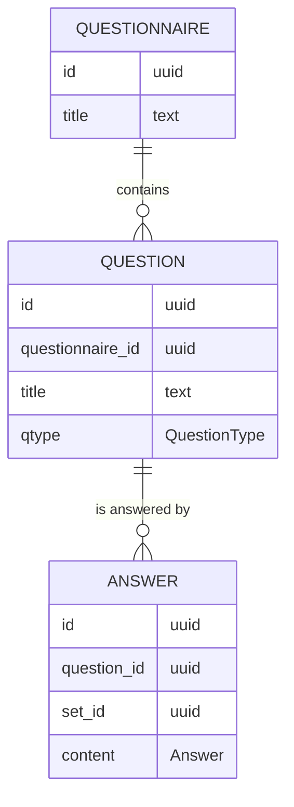

# Forms - Persistence

---

The next step we want to tackle is persisting our data.

---

In the Haskell ecosystem there are several libraries one could choose to interact with the database.

They differ a lot in the degree of abstraction they add on top of the database.

The simplest are [postgresql-simple](https://hackage.haskell.org/package/postgresql-simple) and [mysql-simple](https://hackage.haskell.org/package/mysql-simple)

---

We are going to use [rel8](https://hackage.haskell.org/package/rel8), a library which focuses on:

- conciseness
- inferrability
- familiarity

---

First off, We need to think about our database schema

---



---

Let's start working on a new file, say `Infrastructure/Persistence.hs`

```haskell
module Infrastructure.Persistence where
```

---

We need to define the data types necessary to describe the database schema to out application

---

Let's start with questionnaires

```haskell
-- rel8
import Rel8

-- text
import Data.Text

-- uuid
import Data.UUID

data Questionnaire f = Questionnaire
  { questionnaireId    :: Column f UUID
  , questionnaireTitle :: Column f Text
  }
```

---

What is that `f`?

It is a unary type constructor with kind `f :: Type -> Type`, like `[]` and `IO`

It describes the wrapper/context in which the data need to be considered

---

This approach is usually called [Higher-kinded data](https://reasonablypolymorphic.com/blog/higher-kinded-data/).

It is useful to distinguish the shape of data from the context in which they are considered

---

To please `Rel8`, we need to add some deriving clauses

```haskell
{-# LANGUAGE DerivingStrategies #-}
{-# LANGUAGE DeriveGeneric #-}
{-# LANGUAGE DeriveAnyClass #-}

-- base
import GHC.Generics

data Questionnaire f = Questionnaire
  { questionnaireId    :: Column f UUID
  , questionnaireTitle :: Column f Text
  }
  deriving stock Generic
  deriving anyclass Rel8able
```

---

We're explicitly telling the compiler which deriving strategy to use.

---

Next we need to define the schema for the questionnaire table

```haskell
{-# LANGUAGE OverloadedStrings #-}

questionnaireSchema :: TableSchema (Questionnaire Name)
```

---

A `TableSchema (Questionnaire Name)` requires us to provide a `name`, a `schema`, and a name of a column for every field of a `Questionnaire`

```haskell
questionnaireSchema = TableSchema
  { name = "questionnaire"
  , schema = Nothing
  , columns = Questionnaire
    { questionnaireId    = "id"
    , questionnaireTitle = "title"
    }
  }
```

---

This is our first example of a context

```haskell
type Name :: Type -> Type
newtype Name a = Name String
```

It is the constant function which always return a wrapped `String`.

It is useful for documentation.

---

This allows us to connect the Haskell representation of our data with the database representation, while keeping the two completely separate.

---

Now you could try to do the same thing for `Question` and `Answer`, following the schema presented above.

---

```haskell
data Question f = Question
  { questionId              :: Column f UUID
  , questionQuestionnaireId :: Column f UUID
  , questionTitle           :: Column f Text
  , questionType            :: Column f Domain.QuestionType
  }
  deriving stock Generic
  deriving anyclass Rel8able

questionSchema :: TableSchema (Question Name)
questionSchema = TableSchema
  { name    = "question"
  , schema  = Nothing
  , columns = Question
    { questionId              = "id"
    , questionQuestionnaireId = "questionnaire_id"
    , questionTitle           = "title"
    , questionType            = "qtype"
    }
  }

data Answer f = Answer
  { answerId         :: Column f UUID
  , answerQuestionId :: Column f UUID
  , answerSetId      :: Column f UUID
  , answerContent    :: Column f Domain.Answer
  }
  deriving stock Generic
  deriving anyclass Rel8able

answerSchema :: TableSchema (Answer Name)
answerSchema = TableSchema
  { name    = "answer"
  , schema  = Nothing
  , columns = Answer
    { answerId         = "id"
    , answerQuestionId = "question_id"
    , answerSetId      = "set_id"
    , answerContent    = "content"
    }
  }
```

---

To many fields are using the `UUID` type and the change of confusing between them is extremely high.

We want those fields to have a different type at the Haskell level, so that the type system would prevent us from making a mistake.

---

We are going to use [`newtype`s](https://wiki.haskell.org/Newtype). They wrap a single data type to create a different data type with the same runtime representation.

```haskell
newytpe Age = Age Int
```

It allows us to enlarge our domain language without incurring in any runtime overhead.

---

We are going to define domain specific `id`s.

```haskell
newtype QuestionnaireId = QuestionnaireId UUID
  deriving newtype (DBType)

newtype QuestionId = QuestionId UUID
  deriving newtype (DBType)

newtype AnswerId = AnswerId UUID
  deriving newtype (DBType)

newtype AnswerSetId = AnswerSetId UUID
  deriving newtype (DBType)
```

and use them in the relevant places

---

Now it is time to start writing some queries!

---

The first query we want to write is to extract all the available questionnaires:

```haskell
allQuestionnaires = each questionnaireSchema
```

We are defining a value which represents the query which extracts all rows from the table described by the `questionnaireSchema`.

---

The type of `allQuestionnaiers` is

```haskell
allQuestionnaires :: Query (Questionnaire Expr)
```

It means that `allQuestionnaires` is a `Query` producing `Questionnaire`s in the `Expr` context.

We use the `Expr` context to create valid typed SQL expressions.

---

Next we want to retrieve all the `Question`s for a single `Questionnaire`.

We want to create a `Query` which produces `Question`s, given a specific `QuestionnaireId`

```haskell
questionnaireQuestions :: QuestionnaireId -> Query (Question Expr)
```

---

We start by retrieving all the `Question`s


```haskell
questionnaireQuestions questionnaireId = do
  question <- each questionSchema
  _
```

---

Wait wait wait, what is that `do` doing here? Wasn't it something to be used in `IO`?

---

Actually, `do` notation is far more general and works for every [`Monad`](https://hackage.haskell.org/package/base-4.16.1.0/docs/Prelude.html#t:Monad).

For our purposes a monad is a data structure which allows executing sequential computation is a given context.

---

As you might expect, `IO` is a monad, `[]` is a monad and `Query` is a monad.

---

And then we filter only the `questions` which have the correct `QuestionnairId`

`Rel8` offers us a `where_` combinator which allows us to filter based on a criterion.

```haskell
  where_ $ _
  _
```

where the `_` has type `Expr Bool`

---

First we want to extract the `questionQuestionnaireId`.

We can use the `questionQuestionnaireId` field as a function

```haskell
  where_ $ _ (questionQuestionnaireId question)
```

and be left with a hole `_ :: Expr QuestionnaireId -> Expr Bool` to fill.

---

We need to compare our `questionQuestionnaireId question` with the `questionId` we got as input.

We can do this using the [`(==.)`](https://hackage.haskell.org/package/rel8-1.3.1.0/docs/Rel8.html#v:-61--61-.) operator.

```haskell
  where_ $ questionQuestionnaireId question ==. _
```

---

The compiler is signalling us that we are missing a `DBEq` instance on `QuestionnaireId`.

Actually, let's add it to all the `Id`s type we introduced.

```haskell
  deriving newtype (DBType, DBEq)
```

---

Now we need a value of type `Expr QuestionnaireId` to fill our remaining hole.

We can use the [`lit`](https://hackage.haskell.org/package/rel8-1.3.1.0/docs/Rel8.html#v:lit) function to lift our `QuestionnaireId` to the `Expr` context.

```haskell
  where_ $ questionQuestionnaireId question ==. lit questionnaireId
```

---

As a last step, we need to return a value

```haskell
questionnaireQuestions questionnaireId = do
  question <- each questionSchema
  where_ $ questionQuestionnaireId question ==. lit questionnaireId
  pure question
```

---

As an exercise, try to implement yourself the query to retrieve all the answers for a specific questionnaire

---

```haskell
questionnaireAnswers :: QuestionnaireId -> Query (Answer Expr)
questionnaireAnswers questionnaireId = do
  question <- questionnaireQuestions questionnaireId
  answer <- each answerSchema
  where_ $ answerQuestionId answer ==. questionId question
  pure answer
```


---

Which interactions would we need?

- create a new questionnaire
- add a new question to a questionnaire
- get all questionnaires
- get all the questions for a questionnaire
- add all the answers of a questionnaire
- get all the answers for a questionnaire, grouped by
  - question
  - answer_set
- get all the answers for an answer_set
- get all the answers for a question

---

`groupBy`

```haskell
groupBy :: forall exprs aggregates. (EqTable exprs, Aggregates aggregates exprs) => exprs -> aggregates

Aggregates aggregates exprs => Transposes Aggregate Expr aggregates exprs

groupBy :: forall exprs aggregates. (EqTable exprs, Transposes Aggregate Expr aggregates exprs) => exprs -> aggregates

Transposes Aggregate Expr aggregates exprs => (Table Aggregate aggregates, Table Expr exprs, Congruent aggregates exprs, exprs ~ Transpose Expr aggregates, aggregates ~ Transpose Aggregate exprs)

groupBy :: forall exprs aggregates. (EqTable exprs, Table Aggregate aggregates, Table Expr exprs, Congruent aggregates exprs, exprs ~ Transpose Expr aggregates, aggregates ~ Transpose Aggregate exprs) => exprs -> aggregates

Congruent a b => Columns a ~ Columns b

groupBy :: forall exprs aggregates. (EqTable exprs, Table Aggregate aggregates, Table Expr exprs, Columns exprs ~ Columns aggregate, exprs ~ Transpose Expr aggregates, aggregates ~ Transpose Aggregate exprs) => exprs -> aggregates
```

does it work with `exprs ~ Expr a` and `aggregates ~ Aggregate a`

```
EqTable (Expr a) -- yes if `Sql DBEq a`

Table Aggregate (Aggregate a) -- yes if `Sql DBType a`

Table Expr (Expr a) -- yes if `Sql DBType a`

Columns (Expr a) ~ Columns (Aggregate a) -- yes

Expr a ~ Transpose Expr (Aggregate a) -- yes

Aggregate a ~ Transpose Aggregate (Expr a) -- yes
```

so we can consider

```haskell
groupBy :: (Sql DBEq a, SQL DBType a) => Expr a -> Aggregate a
́́```
