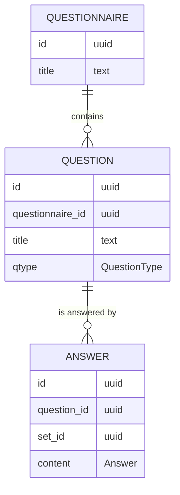

# Forms - Persistence

---

The next step we want to tackle is persisting our data.

---

In the Haskell ecosystem there are several libraries one could choose to interact with the database.

They differ a lot in the degree of abstraction they add on top of the database.

The simplest are [postgresql-simple](https://hackage.haskell.org/package/postgresql-simple) and [mysql-simple](https://hackage.haskell.org/package/mysql-simple)

---

We are going to use [rel8](https://hackage.haskell.org/package/rel8), a library which helps us to abstract away from the database and have a very Haskell-oriented approach

---

First off, We need to think about our database schema

---



---

Let's start working on a new file, say `Infrastructure/Persistence.hs`

```haskell
module Infrastructure.Persistence where
```

---

We need to define the data types necessary to describe the database schema to out application

---

Let's start with questionnaires

```haskell
-- rel8
import Rel8

-- text
import Data.Text

-- uuid
import Data.UUID

data Questionnaire f = Questionnaire
  { questionnaireId    :: Column f UUID
  , questionnaireTitle :: Column f Text
  }
```

---

What is that `f`?

It describes the context (e.g. documentation/query expressions/results) in which the data need to be considered

---

This approach is usually called [Higher-kinded data](https://reasonablypolymorphic.com/blog/higher-kinded-data/).

It is useful to distinguish the shape of data from the context in which they are considered

---

To please `Rel8`, we need to add some deriving clauses

```haskell
{-# LANGUAGE DeriveGeneric #-}
{-# LANGUAGE DeriveAnyClass #-}

-- base
import GHC.Generics

data Questionnaire f = Questionnaire
  { questionnaireId    :: Column f UUID
  , questionnaireTitle :: Column f Text
  }
  deriving (Generic, Rel8able)
```

---

Next we need to connect this Haskell representation to the database representation. We do this by defining the schema for the questionnaire table

```haskell
questionnaireSchema :: TableSchema (Questionnaire Name)
```

---

A `TableSchema (Questionnaire Name)` requires us to provide a `name`, a `schema`, and a name of a column for every field of a `Questionnaire`

```haskell
{-# LANGUAGE OverloadedStrings #-}

questionnaireSchema = TableSchema
  { name = "questionnaire"
  , schema = Nothing
  , columns = Questionnaire
    { questionnaireId    = "id"
    , questionnaireTitle = "title"
    }
  }
```

---

This is our first example of a context

```haskell
data Name a = Name String
```

`Name a` is a datatype that contains a `String` for every type `a`.

It is useful for documentation.

---

This allows us to connect the Haskell representation of our data with the database representation, while keeping the two completely separate.

---

Now you could try to do the same thing for `Question` and `Answer`, following the schema presented above.

---

```haskell
data Question f = Question
  { questionId              :: Column f UUID
  , questionQuestionnaireId :: Column f UUID
  , questionTitle           :: Column f Text
  , questionType            :: Column f QuestionType
  }
  deriving (Generic, Rel8able)

questionSchema :: TableSchema (Question Name)
questionSchema = TableSchema
  { name    = "question"
  , schema  = Nothing
  , columns = Question
    { questionId              = "id"
    , questionQuestionnaireId = "questionnaire_id"
    , questionTitle           = "title"
    , questionType            = "qtype"
    }
  }

data Answer f = Answer
  { answerId         :: Column f UUID
  , answerQuestionId :: Column f UUID
  , answerSetId      :: Column f UUID
  , answerContent    :: Column f Answer
  }
  deriving (Generic, Rel8able)

answerSchema :: TableSchema (Answer Name)
answerSchema = TableSchema
  { name    = "answer"
  , schema  = Nothing
  , columns = Answer
    { answerId         = "id"
    , answerQuestionId = "question_id"
    , answerSetId      = "set_id"
    , answerContent    = "content"
    }
  }
```

---

As soon as we import `Domain.Forms`, we have different data types with same name in scope, and that is creating conflicts!

---

We can solve this with a qualified import

```haskell
import qualified Domain.Forms as Domain
```

and then using the `Domain` namespace to disambiguate appearances

---

To use `Domain.QuestionType` and `Domain.Answer` they need to have an instance of `DBType`. Following [the documentation](https://rel8.readthedocs.io/en/latest/concepts/dbtype.html?highlight=ReadShow#deriving-dbtype-via-readshow) of `Rel8`, we can just cleverly derive it

```haskell
{-# LANGUAGE DerivingVia #-}

-- rel8
import Rel8

data QuestionType
  = Paragraph
  | Number
  deriving stock (Read, Show)
  deriving DBType via ReadShow QuestionType

data Answer
  = ParagraphAnswer Text
  | NumberAnswer Int
  deriving stock (Read, Show)
  deriving DBType via ReadShow Answer
```

---

To many fields are using the `UUID` type and the change of confusing between them is extremely high.

We want those fields to have a different type at the Haskell level, so that the type system would prevent us from making a mistake.

---

We are going to use [`newtype`s](https://wiki.haskell.org/Newtype). They wrap a single data type to create a different data type with the same runtime representation.

```haskell
newytpe Age = Age Int
```

It allows us to enlarge our domain language without incurring in any runtime overhead.

---

We are going to define domain specific `id`s.

```haskell
{-# LANGUAGE DerivingStrategies #-}
{-# LANGUAGE GeneralizedNewtypeDeriving #-}

newtype QuestionnaireId = QuestionnaireId UUID
  deriving newtype (DBType)

newtype QuestionId = QuestionId UUID
  deriving newtype (DBType)

newtype AnswerId = AnswerId UUID
  deriving newtype (DBType)

newtype AnswerSetId = AnswerSetId UUID
  deriving newtype (DBType)
```

and use them in the relevant places

---

Notice the `newtype` keyword after `deriving`. Since there is more than one way to derive an instance, we explicitly inform the compiler which strategy should be used.

---

Now it is time to start writing some queries!

---

The first query we want to write is to extract all the available questionnaires:

```haskell
-- SQL: SELECT * FROM questionnaire
allQuestionnaires = each questionnaireSchema
```

We are defining a value which represents the query which extracts all rows from the table described by the `questionnaireSchema`.

---

The type of `allQuestionnaires` is

```haskell
allQuestionnaires :: Query (Questionnaire Expr)
```

It means that `allQuestionnaires` is a `Query` producing `Questionnaire`s in the `Expr` context.

We use the `Expr` context to create valid typed SQL expressions.

---

Next we want to retrieve all the `Question`s for a single `Questionnaire`.

```sql
SELECT * FROM question
WHERE questionnaier_id = :questionnaire_id
```

---

We want to create a `Query` which produces `Question`s, given a specific `QuestionnaireId`

```haskell
questionnaireQuestions :: QuestionnaireId -> Query (Question Expr)
```

---

We start by retrieving all the `Question`s


```haskell
questionnaireQuestions questionnaireId = do
  question <- each questionSchema
  _
```

---

This is the same `do` notation we saw for `IO`

---

Actually, `do` notation is far more general and works for every [`Monad`](https://hackage.haskell.org/package/base-4.16.1.0/docs/Prelude.html#t:Monad).

For our purposes a monad instance on a data structure allows executing sequential computation is a given context.

---

As you might expect, `IO` is a monad, and `Query` is a monad.

---

And then we filter only the `questions` which have the correct `QuestionnaireId`

`Rel8` offers us a `where_` combinator which allows us to filter based on a criterion.

```haskell
  where_ $ _
  _
```

where the first `_` has type `Expr Bool`

---

First we want to extract the `questionQuestionnaireId`.

We can use the `questionQuestionnaireId` field as a function

```haskell
  where_ $ _ (questionQuestionnaireId question)
```

and be left with a hole `_ :: Expr QuestionnaireId -> Expr Bool` to fill.

---

We need to compare our `questionQuestionnaireId question` with the `questionId` we got as input.

We can do this using the [`(==.)`](https://hackage.haskell.org/package/rel8-1.3.1.0/docs/Rel8.html#v:-61--61-.) operator.

```haskell
  where_ $ questionQuestionnaireId question ==. _
```

---

The compiler is signalling us that we are missing a `DBEq` instance on `QuestionnaireId`, which is needed to compare fields for equality.

Actually, let's add it to all the `Id`s type we introduced.

```haskell
  deriving newtype (DBType, DBEq)
```

---

Now we need a value of type `Expr QuestionnaireId` to fill our remaining hole.

We can use the [`lit`](https://hackage.haskell.org/package/rel8-1.3.1.0/docs/Rel8.html#v:lit) function to lift our `QuestionnaireId` to the `Expr` context.

```haskell
  where_ $ questionQuestionnaireId question ==. lit questionnaireId
```

---

As a last step, we need to return a value

```haskell
questionnaireQuestions questionnaireId = do
  question <- each questionSchema
  where_ $ questionQuestionnaireId question ==. lit questionnaireId
  pure question
```

---

As an exercise, try to implement yourself the query to retrieve all the answers for a specific questionnaire

---

```haskell
questionnaireAnswers :: QuestionnaireId -> Query (Answer Expr)
questionnaireAnswers questionnaireId = do
  question <- questionnaireQuestions questionnaireId
  answer <- each answerSchema
  where_ $ answerQuestionId answer ==. questionId question
  pure answer
```

---

Now we would like to execute this last query and print results to the console

We're not going to analyze the code in detail, we're just going to check that it works

---

First, we need to be able to print some `Answer Result`

```haskell

{-# LANGUAGE StandaloneDeriving #-}
{-# LANGUAGE TypeFamilies #-}

deriving stock instance f ~ Result => Show (Answer f)
```

---

We need also to add a `Show` instance for all the fields of `Answer f`.

---

Then we can write our `main` function to run the query and print its results

```haskell
{-# LANGUAGE OverloadedStrings #-}

module Main where

-- import Forms
import Infrastructure.Persistence

-- base
import Data.Maybe

-- bytestring
import Data.ByteString.Char8

-- hasql
import Hasql.Connection
import Hasql.Session

-- rel8
import Rel8

-- uuid
import Data.UUID

main :: IO ()
main = do
  connection <- acquire "host=localhost port=5432 dbname=db user=user password=pwd"
  either
    (fail . unpack . fromMaybe "unable to connect to the database")
    (\connection' -> do
      response <- run (statement () . select $ questionnaireAnswers (QuestionnaireId nil)) connection'
      print response)
    connection
```

---

And we can try to run it with

```bash
stack exec forms
```

The results will depend on the data you have in your database

---

All other queries we need are provided by us.

---

Now we need to restructure a bit our domain so that it could reflect the information we are storing in our database.

Still we want to keep our domain completely separate from the database layer

---

We want to rewrite our domain with the new knowledge we have about it.

We will structure it more carefully, separating each entity in a separate file.

---

Let's start from `Questionnaire`, which has only a `title` attribute

```haskell
module Domain.Forms.Questionnaire where

-- text
import Data.Text

newtype Questionnaire = Questionnaire
  { title :: Text
  }
```

---

Similarly, we define also `Question` in a separate module

```haskell
module Domain.Forms.Question where

-- text
import Data.Text

data Question = Question
  { title :: Text
  , qtype :: QuestionType
  }
```

---

We need to migrate also the `QuestionType` data type in the same module

```haskell
data QuestionType
  = Paragraph
  | Number
  deriving stock (Read, Show)
  deriving DBType via ReadShow QuestionType
```

---

Do not forget to update the import in the database module

```haskell
import qualified Domain.Forms.Question as Domain
```

---

Next we define another module for `Answer`

```haskell
module Domain.Forms.Answer where

data Answer = Answer
  { setId   :: SetId
  , content :: Content
  }
```

---

We need to move also the `SetId` and the `Content` data types

```haskell
newtype SetId = SetId UUID
  deriving newtype (DBType, DBEq, Show)

data Content
  = ParagraphAnswer Text
  | NumberAnswer Int
  deriving stock (Read, Show)
  deriving (DBType, DBEq) via ReadShow Content
```

---

We also want to use the new data types we just created in our database module

```haskell
import qualified Domain.Forms.Answer as Answer

data Answer f = Answer
  { answerId         :: Column f AnswerId
  , answerQuestionId :: Column f QuestionId
  , answerSetId      :: Column f Answer.SetId
  , answerContent    :: Column f Answer.Content
  }
  deriving (Generic, Rel8able)
```

---

There is another thing we want to lift at the domain level, and it's all the entity `Id`s.

Still, we want to keep them separate from the entities themselves.

---

This is also an occasion to remove some boilerplate and consolidate the logic around `Id`s

---

We can create a single `Id` that distinguishes at the type level which entity it is referring to

```haskell
{-# LANGUAGE DerivingStrategies #-}
{-# LANGUAGE GeneralizedNewtypeDeriving #-}

module Domain.Forms.Id where

-- rel8
import Rel8

--uuid
import Data.UUID
import Data.UUID.V4

newtype Id a = Id UUID
  deriving newtype (DBType, DBEq, Show)

generate :: IO (Id a)
generate = Id <$> nextRandom
```

---

`Id Question` and `Id Answer` are two different types. The compiler will always refuse to use one where the other is expected, even though their runtime representation is the same

---

Now let's use this new `Id` at the database level

Let's remove `QuestionnaireId`, `QuestionId` and `AnswerId` and replace them with `Id`

---

Now that we have our domain entities, we want to define an interface for the possible interactions we could have with them.

We will use the [Repository pattern](https://www.martinfowler.com/eaaCatalog/repository.html), to mediate between the domain and the persistence layers using a collection-like interface for accessing domain values.

It will be our interface to access and interact with the domain. It also allows defining multiple implementations (e.g. one for production and one for testing)

---

Let's start creating a repository for the `Questionnaire` entity.

Which are the interactions we need?

We want to create a new questionnaire and to retrieve all the questionnaires

---

We create a record with all our interactions

```haskell
data QuestionnaireRepository m = QuestionnaireRepository
  { createNewQuestionnaire  :: Questionnaire -> m (Id Questionnaire)
  , selectAllQuestionnaires :: m [Questionnaire]
  }
```

---

What does the `m` represent?

It stands for the context where the results of our operations are going to live.

It is needed because those operations need to allow some effect to happen.

The `m` tracks the possible effects which are allowed.

---

Similarly, try to define yourself the `QuestionRepository` with the two operations `addNewQuestion` and `selectAllQuestionnaireQuestions`

---

```haskell
module Domain.FormsOld.QuestionRepository where

import Domain.FormsOld.Id
import Domain.FormsOld.Question
import Domain.FormsOld.Questionnaire

data QuestionRepository m = QuestionRepository
  { addNewQuestion                  :: Id Questionnaire -> Question -> m (Id Question)
  , selectAllQuestionnaireQuestions :: Id Questionnaire -> m [Question]
  }
```

---

Now that we defined the interface, let's try to actually implement it using our database code.

---

These concrete implementations are part of the infrastructure layer

```haskell
module Infrastructure.PostgresQuestionnaireRepository where
```

---

Let's start by defining a concrete implementation of our interface and take it from there

```haskell
import Domain.Forms.Id
import qualified Domain.Forms.Questionnaire as Domain
import Domain.Forms.QuestionnaireRepository

postgresQuestionnaireRepository :: QuestionnaireRepository m
postgresQuestionnaireRepository = QuestionnaireRepository
  { createNewQuestionnaire  = postgresCreateNewQuestionnaire
  , selectAllQuestionnaires = postgresSelectAllQuestionnaires
  }

postgresCreateNewQuestionnaire :: Domain.Questionnaire -> m (Id Domain.Questionnaire)
postgresCreateNewQuestionnaire questionnaire = _

postgresSelectAllQuestionnaires :: m [Domain.Questionnaire]
postgresSelectAllQuestionnaires = _
```

---

First we're going to implement `postgresCreateNewQuestionnaire`.

What we need to do is:
- create a new `Id Questionnaire`
- convert from the domain representation to the database representation
- persist the data
- return the newly created `Id`

---

The implementation we are looking for is clearly sequential. This means we need `do` notation, which implies that `m` needs to be a `Monad`

```haskell
postgresCreateNewQuestionnaire :: Monad m => Domain.Questionnaire -> m (Id Domain.Questionnaire)
postgresCreateNewQuestionnaire questionnaire = do
  _
```

---

The first step is creating a new `Id Questionnaire`.

We actually already have an operation to do this

```haskell
generate :: IO (Id a)
```

---

We notice now that `generate` is operating in the `IO` context, while we are working in `m`.

---

The easiest way to make it all work is to use `IO` instead of `m`, knowing that we might need to improve on it later.

```haskell
postgresQuestionnaireRepository :: QuestionnaireRepository IO

postgresCreateNewQuestionnaire :: Domain.Questionnaire -> IO (Id Domain.Questionnaire)
postgresCreateNewQuestionnaire questionnaire = do
  id <- generate
  _
```

---

Now we have all the data necessary to convert the domain representation to the database representation

---

We provide all the conversion functions in a specific `Infrastructure.Serializer` module

```haskell
module Infrastructure.Serializer where

import Domain.Forms.Id
import qualified Domain.Forms.Questionnaire as Domain
import Infrastructure.Persistence

-- rel8
import Rel8

serializeQuesionnaire :: Id Domain.Questionnaire -> Domain.Questionnaire -> Questionnaire Result
serializeQuesionnaire questionnaireId questionnaire = _
```

---

Constructing a `Questionnaire Result` is easy. We just need to use the `Questionnaire` constructor

```haskell
serializeQuesionnaire questionnaireId questionnaire = Questionnaire
  { questionnaireId    = _
  , questionnaireTitle = _
  }
```

---

And then we just fill the holes using the input values

```haskell
import qualified Domain.Forms.Questionnaire as Questionnaire

serializeQuesionnaire questionnaireId questionnaire = Questionnaire
  { questionnaireId    = questionnaireId
  , questionnaireTitle = Questionnaire.title questionnaire
  }
```

---

Now we can use our serialization function in the implementation of `postgresCreateNewQuestionnaire`

```haskell
import Infrastructure.Serializer

postgresCreateNewQuestionnaire questionnaire = do
  id <- generate
  let serializedQuestionnaire = serializeQuesionnaire id questionnaire
  _
```

---

Now we can create our query

```haskell
import Infrastructure.Persistence

-- rel8
import Rel8

postgresCreateNewQuestionnaire questionnaire = do
  id <- generate
  let serializedQuestionnaire = serializeQuesionnaire id questionnaire
      addQuestionnaire        = add questionnaireSchema [lit serializedQuestionnaire]
  _
```

note:
- `add` needs to be provided

---

And run it

```haskell
-- hasql
import Hasql.Session

-- rel8
import Rel8

postgresCreateNewQuestionnaire questionnaire = do
  id <- generate
  let serializedQuestionnaire = serializeQuesionnaire id questionnaire
      addQuestionnaire        = add questionnaireSchema [lit serializedQuestionnaire]
  eitherError <- run (statement () . insert $ addQuestionnaire) connection
  _
```

---

`run` requires a `connection` to work, so we need to pass that as an argument

```haskell
import Hasql.Connection

postgresCreateNewQuestionnaire :: Connection -> Domain.Questionnaire -> IO (Id Domain.Questionnaire)
postgresCreateNewQuestionnaire connection questionnaire = do
  id <- generate
  let serializedQuestionnaire = serializeQuesionnaire id questionnaire
      addQuestionnaire        = add questionnaireSchema [lit serializedQuestionnaire]
  eitherError <- run (statement () . insert $ addQuestionnaire) connection
  _
```

---

We need to propagate that argument to `postgresQuestionnaireRepository`

```haskell
postgresQuestionnaireRepository :: Connection -> QuestionnaireRepository IO
postgresQuestionnaireRepository connection = QuestionnaireRepository
  { createNewQuestionnaire  = postgresCreateNewQuestionnaire connection
  , selectAllQuestionnaires = postgresSelectAllQuestionnaires
  }
```

---

Last thing we need to do is return the newly crafted `id`. We need to be careful though to manage carefully the case in which the query actually failed. This is signalled by the `Either` returned by `run`.

The most sensible thing we can do is pass on the information to the caller

```haskell
postgresCreateNewQuestionnaire :: Connection -> Domain.Questionnaire -> IO (Either QueryError (Id Domain.Questionnaire))
```

This does not work since the return type of `createNewQuestionnaire` for a `QuestionnaireRepository` needs to be of the form `m (Id Questionnaire)`.

We need to somehow move the `Either QueryError` inside the `m`.

---

The solution is to use a monad transformer

```haskell
-- from Control.Monad.Trans.Except

newtype ExceptT e m a = ExceptT (m (Either e a))
```

If we specialize this to `m = IO` and `e = QueryError`, we get exactly the type we're using

---

What do we gain?

```haskell
instance (Monad m) => Monad (ExceptT e m)
```

Moreover, the monad instance handles failures automatically, i.e.

```haskell
foo :: Monad m => EitherT e m a
foo = do
  a
  b
```

If `a` fails (i.e. it returns a `Left`), then `b` is skipped and the whole computation fails with the result of `a`.

---

We can adapt our code to use `ExceptT QueryError IO`

```haskell
postgresCreateNewQuestionnaire :: Connection -> Domain.Questionnaire -> ExceptT QueryError IO (Id Domain.Questionnaire)
```

we need to update also

```haskell
postgresQuestionnaireRepository :: Connection -> QuestionnaireRepository (ExceptT QueryError IO)
```

---

Now `generate` is no more OK, because it returns something in `IO`, while here we are working in `ExceptT QueryError IO`.

Luckily we have a function `liftIO :: IO a -> ExceptT e m a ` which allows us to lift values in `IO` to `EitherT e m`.

```haskell
-- base
import Control.Monad.IO.Class

postgresCreateNewQuestionnaire connection questionnaire = do
  id <- liftIO generate
  ...
```

---

Similarly, `run` does not work because it returns a `IO (Either QueryError ())`.

We just need to wrap it in the `ExceptT` newtype.

The code now becomes

```haskell
postgresCreateNewQuestionnaire connection questionnaire = do
  id <- liftIO generate
  let serializedQuestionnaire = serializeQuesionnaire id questionnaire
      addQuestionnaire        = add questionnaireSchema [lit serializedQuestionnaire]
  ExceptT $ run (statement () . insert $ addQuestionnaire) connection
  _
```

---

Eventually, we can map over our error and return our desired value

```haskell
postgresCreateNewQuestionnaire connection questionnaire = do
  id <- liftIO generate
  let serializedQuestionnaire = serializeQuesionnaire id questionnaire
      addQuestionnaire        = add questionnaireSchema [lit serializedQuestionnaire]
  ExceptT $ run (statement () . insert $ addQuestionnaire) connection
  pure id
```

---

Exercise for you: implement the `postgresSelectAllQuestionnaires` interaction

```haskell
-- Infrastructure.Serializer
deserializeQuestionnaire :: Questionnaire Result -> (Id Domain.Questionnaire, Domain.Questionnaire)
deserializeQuestionnaire questionnaire =
  ( questionnaireId questionnaire
  , Domain.Questionnaire $ questionnaireTitle questionnaire
  )

-- Infrastructure.PostgresQuestionnaireRepository

postgresSelectAllQuestionnaires :: Connection -> ExceptT QueryError IO [Domain.Questionnaire]
postgresSelectAllQuestionnaires connection = do
  questionnaires <- ExceptT $ run (statement () . select $ allQuestionnaires) connection
  pure $ snd . deserializeQuestionnaire <$> questionnaires
```

---

## Learned concepts

- higher kinded types and higher kinded data
- `newtype`
- deriving strategies and `newtype` deriving
- `do` works for any `Monad`
- separating interface from implementation
- monad transformers
